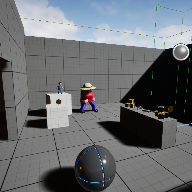

# Project Name  VRExperience2

## Description

A github repository for the in class demonstration code for fall 2024 MDEV1003.    

Recording of headset experience at Youtube ( https://youtu.be/PNM2_DutWFU )
 
## Usage
Clone, or download the zip, to a local directory. Open in Unreal Engine 5.4 or newer

## Attributions
1. "Chucky" character via MakeHuman project, and animated with Mixamo.com
2. Ribbed chipped metal,  from FreePBR, ( https://freepbr.com/product/ribbed-chipped-metal/ )
3. Bumpy ground, FreePBR, ( https://freepbr.com/product/bumpy-worn-ground/ )

 

